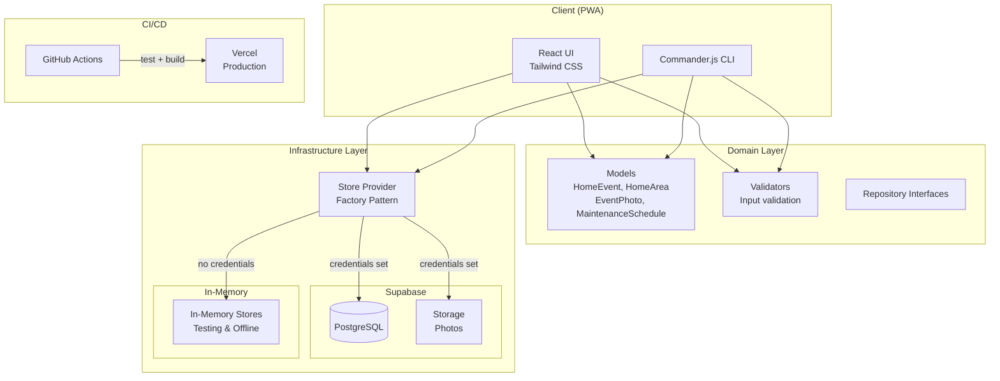

# System Architecture

```mermaid
graph TB
    subgraph "Client (PWA)"
        UI[React UI<br/>Tailwind CSS]
        CLI[Commander.js CLI]
    end

    subgraph "Domain Layer"
        Models[Models<br/>HomeEvent, HomeArea<br/>EventPhoto, MaintenanceSchedule]
        Validators[Validators<br/>Input validation]
        Services[Repository Interfaces]
    end

    subgraph "Infrastructure Layer"
        Provider[Store Provider<br/>Factory Pattern]
        subgraph "Supabase"
            SDB[(PostgreSQL)]
            SStorage[Storage<br/>Photos]
        end
        subgraph "In-Memory"
            MemStore[In-Memory Stores<br/>Testing & Offline]
        end
    end

    UI --> Models
    UI --> Validators
    UI --> Provider
    CLI --> Models
    CLI --> Validators
    CLI --> Provider
    Provider -->|credentials set| SDB
    Provider -->|credentials set| SStorage
    Provider -->|no credentials| MemStore

    subgraph "CI/CD"
        GHA[GitHub Actions]
        Vercel[Vercel<br/>Production]
    end

    GHA -->|test + build| Vercel
```
